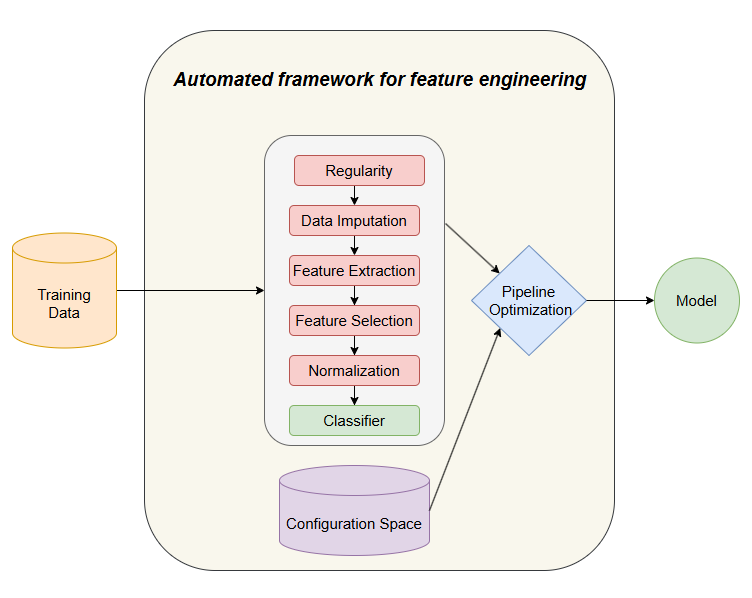

# OptimusPipe

This project aims to develop a package that automates and optimized the feature engineering process in the context of predictive maintenance, addressing problems such as irregularity, value imputation, feature extraction, feature selection, and normalization.
An overview image can be seen below:

This framework was developed within the context of the master thesis "Automated feature engineering for predictive maintenance"

## Usage

The main file is the optimusPipe.py where the function responsible for optimizing and automating the feature engineering process is used.
An example of how to use the framework is provided in optimusPipe.py file.
The package gives the user the possibility to choose the steps that the pipeline will have, the parameter distribution, the feature extractors and the search strategy used.

## Tests

The tests are inside the test folder and each script can be run individually.
Tests enphasize the imputation transformers.

## Case study

The framework was validated through a case study on the pharmaceutical industry, more precisely over a compression machine used on the production of pills.
First the optimusPipe was used to get the best results.
Then the run_best_pipeline.py file is responsible for creating the results based on the best pipeline obtained previously, with variations on the final classifier, plus 2 different baselines for comparison. The results are stored in analysis\tables\best_baseline_comparison.tex

The other results are obtained by running the scripts inside the analysis folder, individually, in no particular order, and the results are stored under the directories analysis\plots and analysis\tables

  
  
